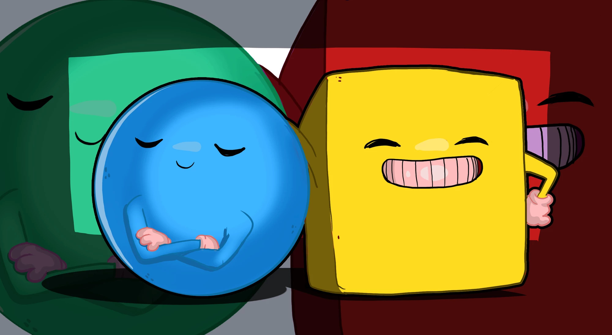

[Tiago Sanches da Silva](http://lattes.cnpq.br/6420362418520641). Jogos
Digitais. [Insper](https://github.com/Insper), 2023.

    <a href="http://unity.com">Unity Technologies (2023)</a>

# Roll-a-Ball

[Roll a Ball](https://learn.unity.com/project/roll-a-ball), an engaging and
straightforward game that incorporates essential game development principles,
including physics and user interface design. In this game, players take control
of a rolling ball using keyboard inputs, harnessing the power of physics to
navigate it through the game board. Along the way, the game detects interactions
between the ball and various objects, enabling players to collect them. Victory
is achieved once all collectible objects have been gathered.

## References

SHEKHAR, Gyanendu. **Smooth camera follow in Unity 3D**. Gyanendu Shekhar's Blog. 2020. [gyanendushekhar.com/2020/03/10/smooth-camera-follow-in-unity-3d](http://gyanendushekhar.com/2020/03/10/smooth-camera-follow-in-unity-3d).

jaxas. **Smooth look at**. Unity Forums. July, 7th. 2009. [forum.unity.com/threads/smooth-look-at.26141](https://forum.unity.com/threads/smooth-look-at.26141).

## License

This project is MIT licensed. [See more](LICENSE).
